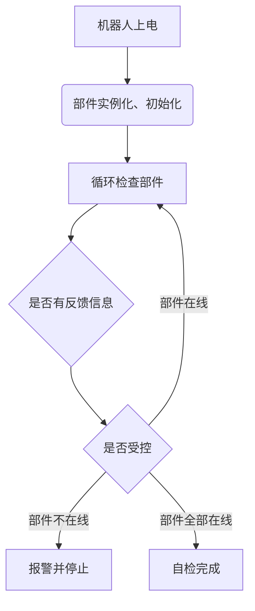

# 机器人系统

## 简介
`RobotSystem` 库被设计用于管理机器人的状态和行为。

## 主要功能

- **状态管理**：管理机器人的状态，控制和监控有限状态机的运行
- **开机自检**：实现机器人开机自检功能，并反映到一些变量上
- **LED显示控制**：与LED_Ws2812库联动，通过LED反馈机器人的运行状态

## 依赖
本库与有限状态机库 `StateMachine` 有 <u>***强绑定关系***</u>

## 流程详解

### 开机自检
在所有实例化和初始化结束之后，机器人系统会首先组织 ***自检*** 行为

### 持续自检
即使已经完成了开机自检，机器人系统仍会持续监控各个部件的状态，确保其正常运行

可以通过设置不同部件的 ***紧急度***，机器人系统会在不同的紧急度下采取不同的措施

>`Essential` : 必须在线的核心部件，如果其掉线，机器人完全无法运行或面临严重损坏风险  
`Important` : 重要部件，如果其掉线，机器人可能无法完成某些功能，但仍能继续运行  
`Normal` : 普通部件，如果其掉线，机器人仍能继续运行

在默认模式下，所有的部件默认都为 `Normal` 紧急度